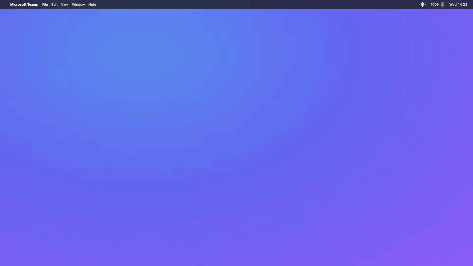
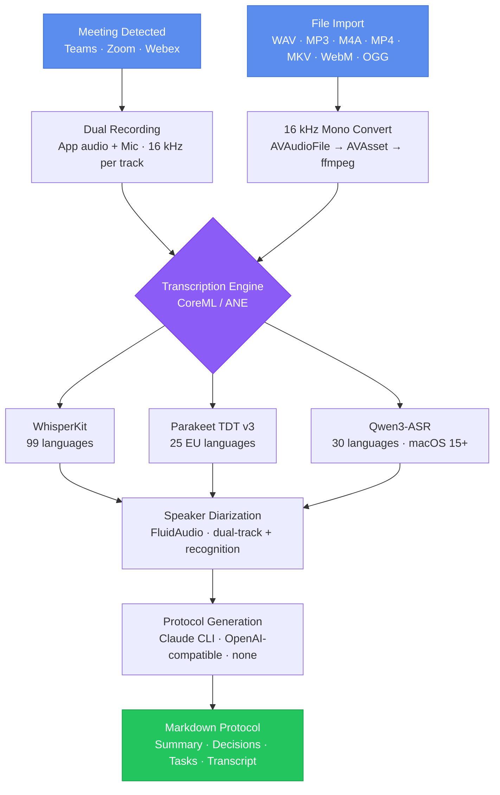
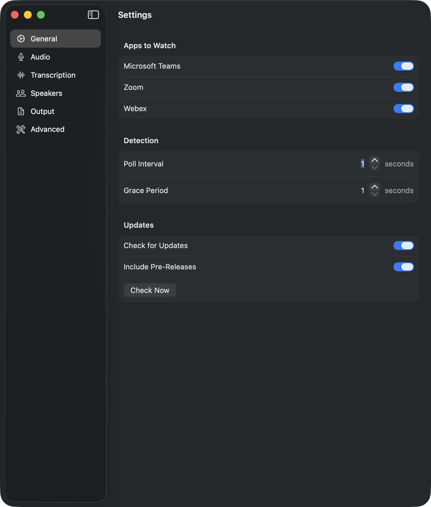

# Meeting Transcriber

> **The local-first meeting transcriber for macOS.** Records Teams, Zoom, and Webex calls, transcribes them on-device with Whisper / Parakeet / Qwen3, separates speakers, and turns the result into a Markdown protocol using your own Claude CLI or any local LLM. **No cloud. No subscription. No audio ever leaves your Mac.**

<p align="center">
  
</p>

<p align="center">
  <a href="https://github.com/pasrom/meeting-transcriber/actions?query=branch%3Amain"></a>
  <a href="https://github.com/pasrom/meeting-transcriber/releases"></a>
  
  
  <a href="https://github.com/pasrom/meeting-transcriber/blob/main/LICENSE"></a>
  <a href="https://github.com/pasrom/meeting-transcriber/stargazers"></a>
</p>

## Why this exists

Cloud meeting recorders (Otter, Fireflies, Granola, tl;dv) work great, until you remember that every word from every meeting goes to a third-party server. For a lot of teams (legal, healthcare, M&A, anything under NDA, or just folks who'd rather not) that's a non-starter.

Meeting Transcriber runs the entire pipeline (recording, transcription, speaker diarization, summarization) on your Mac. No account, no upload, no monthly bill.

|                                | Cloud transcribers | **Meeting Transcriber** |
|--------------------------------|:------------------:|:-----------------------:|
| Audio leaves your machine      | Yes                | **No**                  |
| Recurring cost                 | $10–30 / month     | **Free**                |
| Works offline                  | No                 | **Yes**                 |
| Choice of summarization LLM    | Vendor-locked      | **Claude · Ollama · LM Studio · any OpenAI API** |
| Per-source speaker separation  | Mixed track        | **Dual-track diarization** |
| Source available               | No                 | **MIT licensed**        |

## Install

```bash
brew tap pasrom/meeting-transcriber
brew install --cask meeting-transcriber
```

The app lives in your menu bar — open it, grant microphone + screen-recording permission, and the first detected Teams/Zoom/Webex call records automatically.

---

## How it works



---

## Features

- **Automatic meeting detection** — Recognizes Teams, Zoom, and Webex meetings via window title polling
- **Dual audio recording** — App audio ([CATapDescription](https://developer.apple.com/documentation/coreaudio/catap)) + microphone simultaneously
- **On-device transcription** — Three engines, selectable in Settings:
  - [WhisperKit](https://github.com/argmaxinc/WhisperKit) — 99+ languages, ~1 GB model
  - [Parakeet TDT v3](https://github.com/FluidInference/FluidAudio) (NVIDIA) — 25 EU languages, ~50 MB model, ~10× faster, custom vocabulary support (CTC boosting)
  - [Qwen3-ASR](https://github.com/FluidInference/FluidAudio) (Alibaba) — 30 languages, ~1.75 GB model, macOS 15+
- **On-device speaker diarization** — [FluidAudio](https://github.com/FluidInference/FluidAudio) via CoreML/ANE — no HuggingFace token needed; two modes: standard (`OfflineDiarizer`) and overlap-aware (`Sortformer`)
- **Dual-track diarization** — App and mic tracks diarized separately for clean speaker separation without echo interference
- **Speaker recognition** — Voice embeddings stored across meetings, matched via cosine similarity
- **VAD preprocessing** — Optional silence trimming via FluidAudio Silero v6 before transcription, with automatic timestamp remapping
- **AI protocol generation** — Structured Markdown via [Claude Code CLI](https://docs.anthropic.com/en/docs/claude-code), OpenAI-compatible APIs (Ollama, LM Studio, etc.), or disabled (save transcript only)
- **Configurable protocol prompt** — Custom prompt file support (`~/Library/Application Support/MeetingTranscriber/protocol_prompt.md`)
- **Manual recording** — Record any app via app picker, not just detected meetings
- **Multi-format input** — Supports WAV, MP3, M4A, MP4, and with ffmpeg also MKV, WebM, OGG
- **Update checker** — Notifies when a new version is available
- **Background processing** — PipelineQueue runs transcription and protocol generation independently from recording
- **Distribution** — Install via Homebrew Cask or build from source

---

## Prerequisites

- macOS 14.2+ (required for CATapDescription audio capture)
- **One of:**
  - [Claude Code CLI](https://docs.anthropic.com/en/docs/claude-code) — installed and logged in (`claude --version`)
  - An OpenAI-compatible API endpoint (e.g. [Ollama](https://ollama.com), LM Studio, llama.cpp) — configure in Settings

No HuggingFace token needed — FluidAudio and WhisperKit download their models automatically on first run.

### Optional: ffmpeg for extra formats

Install ffmpeg to enable MKV, WebM, and OGG support:

```bash
brew install ffmpeg
```

The app detects ffmpeg automatically. Status is shown in Settings → About.

### Using Ollama as provider

1. Install Ollama: `brew install ollama`
2. Pull a model: `ollama pull llama3.1` (or any model that fits your hardware)
3. Start the server: `ollama serve` (runs on `http://localhost:11434` by default)
4. In the app's Settings, select **OpenAI-Compatible API** as provider and set:
   - **Endpoint:** `http://localhost:11434/v1/chat/completions`
   - **Model:** `llama3.1` (must match the pulled model name)

---

## Installation

### Via Homebrew Cask (recommended)

```bash
brew tap pasrom/meeting-transcriber
brew install --cask meeting-transcriber
```

### Pre-release (RC) via Homebrew

```bash
brew tap pasrom/meeting-transcriber
brew install --cask meeting-transcriber@beta
```

> Note: The stable and beta casks conflict — uninstall one before installing the other.

### Build from source

```bash
git clone https://github.com/pasrom/meeting-transcriber
cd meeting-transcriber
./scripts/run_app.sh
```

---

## Permissions

| Permission | Required for | Notes |
|------------|-------------|-------|
| Screen Recording | Meeting detection (window titles) | System Settings → Privacy & Security |
| Microphone | Mic recording | Prompted on first use |
| Accessibility | Mute detection, participant reading (Teams) | System Settings → Privacy & Security |
| App audio capture | — | No permission needed (purple dot indicator only) |

---

## Menu Bar Icon

The app uses an animated waveform icon in the menu bar that reflects the current pipeline stage:

<p>
&nbsp;&nbsp;
&nbsp;&nbsp;
&nbsp;&nbsp;
&nbsp;&nbsp;

</p>

**Idle** → **Recording** (bars bounce) → **Transcribing** (bars morph to text) → **Diarizing** (bars split into groups) → **Protocol** (lines appear sequentially)

### Permission problem badge

<p>

</p>

A red exclamation mark in the bottom-right corner is overlaid on top of the current icon (idle, recording, transcribing, …) whenever one of the required permissions is missing or broken. It means at least one of the following is not in a working state:

- **Microphone** — denied, or granted but the capture engine can't open the device
- **Screen Recording** — denied, or granted but `CGWindowListCopyWindowInfo` returns no window titles (TCC state out of sync)
- **Accessibility** — denied, or granted but the AX API refuses to read Teams participant/mute info

The health check distinguishes *denied* from *broken*. "Broken" usually means the permission is toggled on in System Settings but macOS hasn't actually wired it through — the fix is to toggle the permission off and on again for Meeting Transcriber under **System Settings → Privacy & Security**. Open the menu bar dropdown to see which specific permission is affected; a notification is also posted when the state changes.

### Record-only mode badge

<p>

</p>

A small red dot in the bottom-right corner is overlaid on top of the current icon (idle, recording, transcribing, …) whenever **Record-only mode** is enabled (Settings → General → "Record-only mode"). In this mode the app keeps detecting meetings and producing dual-source recordings, but skips the entire post-recording pipeline (VAD, transcription, diarization, protocol generation). Recordings + a per-meeting `<timestamp>_meta.json` sidecar are dropped into your configured Output Folder for an external pipeline (e.g. a Linux GPU host via Syncthing) to pick up. The dot stays visible across all states so the mode is always clearly indicated; if a permission problem coexists, the red exclamation badge takes precedence.

### Per-channel asymmetric-silence indicator

<p>
&nbsp;&nbsp;

</p>

When one capture channel goes silent while the other is still carrying audio for longer than the configured debounce window, the waveform bars are tinted red to surface the half-broken capture at a glance:

- **Bottom half red** — app-audio channel is dead (you're speaking but nothing from the meeting app is being captured — bad tap, broken routing, system output muted)
- **Top half red** — mic channel is dead (the meeting is audible but your voice isn't being captured — wrong input device, mic muted at system level)
- **Both halves red** — both channels are silent while in recording state

A "Capture Channel Silent" notification fires once per episode at the moment the tint kicks in. Configurable in **Settings → Audio → Per-Channel Indicator** (default: on, 90 s debounce, range 30–300 s). Designed to surface real routing failures without false-positiving during normal speech pauses: the detector uses dual dBFS thresholds with hysteresis so transient dips between syllables don't reset the debounce timer.

If a permission problem coexists, the red exclamation badge takes precedence over the channel-silent tint.

---

## Usage

Launch the app — it sits in your menu bar. When a supported meeting is detected, recording starts automatically. When the meeting ends, the pipeline runs in the background: transcription → diarization → protocol generation.

You can also batch-process existing audio and video files via the menu (⌘P) — supported formats: WAV, MP3, M4A, MP4 (and MKV, WebM, OGG when ffmpeg is installed).

---

## Configuration

Open Settings via the menu bar item or ⌘,.



| Tab | What's in it |
|---|---|
| **General** | Apps to watch (Teams/Zoom/Webex), detection timing, update checks |
| **Audio** | Microphone device, voice activity detection (VAD) |
| **Transcribe** | ASR engine (WhisperKit / Parakeet / Qwen3) and per-engine options (model, language, custom vocabulary) |
| **Speakers** | Diarization, mic speaker name, known voices, recognition stats |
| **Output** | LLM provider (Claude CLI / OpenAI-compatible / none), protocol language, output folder, custom prompt |
| **Advanced** | Permissions status, diagnostics, version info |

---

## Output

Files are saved to `~/Library/Application Support/MeetingTranscriber/protocols/`:

| File | Content |
|------|---------|
| `20260225_1400_meeting.txt` | Raw transcript |
| `20260225_1400_meeting.md` | Structured protocol |

**Protocol structure:** Summary, Participants, Topics Discussed, Decisions, Tasks (with responsible person, deadline, priority), Open Questions, Full Transcript.

---

## Troubleshooting

| Problem | Solution |
|---------|----------|
| `claude not found` | Install Claude Code CLI, run `claude --version` — or switch to OpenAI-compatible provider in Settings |
| No meeting detected | Grant Screen Recording permission (System Settings → Privacy & Security) |
| No app audio | Requires macOS 14.2+ for CATapDescription audio capture |
| Empty transcription | Check that the file contains an audio track — the app converts to 16 kHz mono automatically |
| Models not loading | Models download on first run (WhisperKit ~1 GB, Parakeet ~50 MB, Qwen3 ~1.75 GB); check internet connectivity |
| OpenAI-compatible API connection failed | Verify the endpoint URL and that the local model server is running |

### Diagnosing silent app-audio recordings

If a recording's `_app.wav` is silent or unexpectedly quiet, enable verbose audio logging to capture forensic detail during the next attempt:

1. Open **Settings → Diagnostics** and turn on **Verbose Audio Logging**.
2. Reproduce the failing recording.
3. Open **Console.app**, filter by subsystem `com.meetingtranscriber.audiotap`, and look for `[debug]` lines:
   - `[debug] Tap target: pid=… exe=… bundle=… audioObjectID=…` — which process the tap targeted
   - `[debug] Default output device: name=… uid=… transport=… rate=…` — output device at start
   - `[debug] Tap format: rate=… Hz, tapID=…` — sample rate and tap ID after the tap is configured
   - `[debug] App audio RMS (5s): …dBFS, samples=…, totalBytes=…` — every 5 seconds; **tells you live whether the tap is delivering real audio (-40 dBFS or higher) or near-silence (≤ -90 dBFS)**
   - `[debug] Output device change → name=… uid=…` — emitted when the system output device changes mid-recording
   - `[debug] Mic input device: name=… uid=… hwRate=… hwChannels=…` — mic hardware device at capture start
   - `[debug] Mic RMS (5s): …dBFS, samples=…` — every 5 seconds during mic capture
4. Turn the toggle off again when done — the per-5 s RMS log is moderately chatty.

The toggle persists in `UserDefaults` and takes effect on the next recording without an app restart.

---

## Testing & CI

[](https://github.com/pasrom/meeting-transcriber/actions/workflows/ci.yml)
[](https://github.com/pasrom/meeting-transcriber/actions/workflows/e2e.yml)
[](https://github.com/pasrom/meeting-transcriber/actions/workflows/e2e-app.yml)
[](https://github.com/pasrom/meeting-transcriber/actions/workflows/quality-and-safety.yml)
[](https://github.com/pasrom/meeting-transcriber/actions/workflows/appstore.yml)
[](https://codecov.io/gh/pasrom/meeting-transcriber)

Pull requests run unit tests, lint, and analyzer in [`ci.yml`](.github/workflows/ci.yml). Two complementary E2E layers run on a self-hosted Apple Silicon Mac mini against the real production models (no mocks): [`e2e.yml`](.github/workflows/e2e.yml) feeds fixture audio through each ASR engine + the WatchLoop pipeline, and [`e2e-app.yml`](.github/workflows/e2e-app.yml) builds and signs the actual `.app`, drives a simulated meeting via [`tools/meeting-simulator`](tools/meeting-simulator), and asserts on the resulting transcript over the embedded debug RPC server.

---

## License

[MIT](LICENSE)
